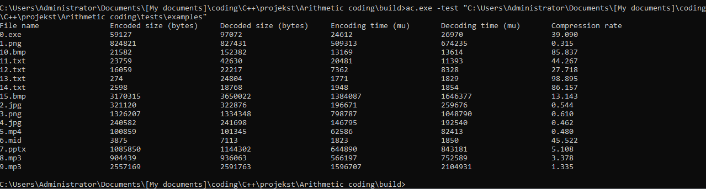

# Арифметическое кодирование
<!-- my info -->

# Введение

## Суть и назначение
---
Алгоритм энтропийного сжатия информации. 

## Авторство
---
Основатель арифметического кодирования - Йорма Риссанен, который с 1976 по начало 1980-х годов проделал значительную работу в этой области теории информации.

## Состояние реализации
---
Существуют базовая и адаптивная версии. 

Адаптивная версия позволяет строить разбиение каждого интервала на подынтервалы в поточном режиме (без предварительного сканирования данных), не имея никаких начальных знаний из исходного распределения, что позволяет за один проход сжать данные. Преимуществом этого способа является возможность кодировать на лету (аналогично адаптивному алгоритму Хаффмана).

В базовой частоты символов постоянны.

## Перспективы использования
---

В отличие от алгоритма Хаффмана, не имеет жёсткого постоянного соответствия входных символов группам битов выходного потока.

Как правило, превосходит алгоритм Хаффмана по эффективности сжатия, позволяет сжимать данные с энтропией, меньшей 1 бита на кодируемый символ, но некоторые версии имеют патентные ограничения от компании IBM

Отлично кодирует чёрно-белые изображения

# Описание алгоритма

## Принцип работы
---

Для описания алгоритма на некотором алфавите с данными о частотности использования символов используется отрезок [0;1], называемый «рабочим», на котором располагаются точки таким образом, что длины образованных отрезков будут равны частоте использования символа, и каждый такой отрезок соответствует одному символу.

Для символа из потока выбирается соответствующий ему отрезок, после чего он становится рабочим отрезком. Далее отрезок разбивается его таким же образом, как был разбит [0;1]; операция выполняется для некоторого числа последовательных символов. Затем выбирается произвольное число из рабочего отрезка. Биты этого числа вместе с длиной его битовой записи и считаются результатом арифметического кодирования использованных символов потока.

Перед началом работы соответствующий тексту интервал есть [0; 1). При обработке очередного символа его ширина сужается за счет выделения этому символу части интервала. Например, применим к тексту "eaii!" алфавита { a,e,i,o,u,! } модель с постоянными вероятностями:

| Символ | Вероятность |  Интервал   |
| :----- | :---------: | :---------: |
| a      |     .2      | [0.0; 0,2)] |
| e      |     .3      | [0.2; 0.5)] |
| i      |     .1      | [0.5; 0.6)] |
| o      |     .2      | [0.6; 0.8)] |
| u      |     .1      | [0.8; 0.9)] |
| !      |     .1      | [0.9; 1.0)] |

И кодировщику, и декодировщику известно, что в самом начале интервал есть [0; 1). После просмотра первого символа "e", кодировщик сужает интервал до [0.2; 0.5), который модель выделяет этому символу. Второй символ "a" сузит этот новый интервал до первой его пятой части, поскольку для "a" выделен фиксированный интервал [0.0; 0.2). В результате получим рабочий интервал [0.2; 0.26), т.к. предыдущий интервал имел ширину в 0.3 единицы и одна пятая от него есть 0.06. Следующему символу "i" соответствует фиксированный интервал [0.5; 0.6), что применительно к рабочему интервалу [0.2; 0.26) суживает его до интервала [0.23, 0.236).

| В начале        |       |    [0.0; 1.0 )    |
| :-------------- | :---: | :---------------: |
| После просмотра |  "e"  |    [0.2; 0.5 )    |
| После просмотра |  "a"  |   [0.2; 0.26 )    |
| После просмотра |  "i"  |  [0.23; 0.236 )   |
| После просмотра |  "i"  |  [0.233; 0.2336)  |
| После просмотра |  "!"  | [0.23354; 0.2336) |

Сначала интервал был [0.0; 1.0)
После просмотра "e"  [0.2; 0.5)

Отсюда ясно, что второй символ - это "a", поскольку это приведет к интервалу [0.2; 0.26), который полностью вмещает итоговый интервал [0.23354; 0.2336). Продолжая работать таким же образом, декодировщик извлечет весь текст.

Декодировщику нет необходимости знать значения обеих границ итогового интервала, полученного от кодировщика. Даже единственного значения, лежащего внутри него, например 0.23355, уже достаточно. (Другие числа - 0.23354,0.23357 или даже 0.23354321 - вполне годятся). Однако, чтобы завершить процесс, декодировщику нужно вовремя распознать конец текста. Кроме того, одно и то же число 0.0 можно представить и как "a", и как "aa", "aaa" и т.д. Для устранения неясности мы должны обозначить завершение каждого текста специальным символом EOF, известным и кодировщику, и декодировщику. Для алфавита из таблицы для этой цели, и только для нее, будет использоваться символ "!". Когда декодировщик встречает этот символ, он прекращает свой процесс.

Для фиксированной модели, задаваемой таблицей, энтропия 5-символьного текста "eaii!" будет:

log 0.3 - log 0.2 - log 0.1 - log 0.1 - log 0.1 = - log 0.00006 ~ 4.22

(Здесь применяем логарифм по основанию 10, т.к. вышерассмотренное кодирование выполнялось для десятичных чисел). Это объясняет, почему требуется 5 десятичных цифр для кодирования этого текста. По сути, ширина итогового интервала есть 0.2336 - 0.23354 = 0.00006, а энтропия отрицательный десятичный логарифм этого числа. Конечно, обычно мы работаем с двоичной арифметикой, передаем двоичные числа и измеряем энтропию в битах.

Пяти десятичных цифр кажется слишком много для кодирования текста из 4-х гласных! Может быть не совсем удачно было заканчивать пример развертыванием, а не сжатием. Однако, ясно, что разные модели дают разную энтропию. Лучшая модель, построенная на анализе отдельных символов текста "eaii!", есть следующее множество частот символов:

{ "e"(0.2), "a"(0.2), "i"(0.4), "!"(0.2) }.

Она дает энтропию, равную 2.89 в десятичной системе счисления, т.е. кодирует исходный текст числом из 3-х цифр.

## Эффективность
---
При кодировании текста арифметическим методом, количество битов в закодированной строке равно энтропии этого текста относительно использованной для кодирования модели. Три фактора вызывают ухудшение этой характеристики:

1. Расходы на завершение текста;
2. Использование арифметики небесконечной точности;
3. Такое масштабирование счетчиков, что их сумма не превышает Max_frequency.

Как было показано, ни один из них не значителен. В порядке выделения результатов арифметического кодирования, модель будет рассматриваться как строгая (в определенном выше смысле).

Арифметическое кодирование должно досылать дополнительные биты в конец каждого текста, совершая т.о. дополнительные усилия на завершение текста. Для ликвидации неясности с последним символом процедура done_encoding() посылает два бита. В случае, когда перед кодированием поток битов должен блокироваться в 8-битовые символы, будет необходимо закругляться к концу блока. Такое комбинирование может дополнительно потребовать 9 битов.

Затраты при использовании арифметики конечной точности проявляются в сокращении остатков при делении. Это видно при сравнении с теоретической энтропией, которая выводит частоты из счетчиков точно также масштабируемых при кодировании. Здесь затраты незначительны - порядка 10^-4 битов/символ.

Дополнительные затраты на масштабирование счетчиков отчасти больше, но все равно очень малы. Для коротких текстов (меньших 2^14 байт) их нет. Но даже с текстами в 10^5 - 10^6 байтов накладные расходы, подсчитанные экспериментально, составляют менее 0.25% от кодируемой строки.

Адаптивная модель в программе 2, при угрозе превышения общей суммой накопленных частот значение Max_frequency, уменьшает все счетчики. Это приводит к тому, что взвешивать последние события тяжелее, чем более ранние. Т.о. показатели имеют тенденцию прослеживать изменения во входной последовательности, которые могут быть очень полезными. (Мы сталкивались со случаями, когда ограничение счетчиков до 6-7 битов давало лучшие результаты, чем повышение точности арифметики).

# Тестирование
В аргументах запуска программы указать флаг -test и путь к папке с экземплярами для тестирования (файлами)

|  |
| :---------------------------------------: |
|           *Пример тестирования*           |

Операции над файлами и их исследование проводятся во временной папке $AC_TEMP, создаваемой в %TEMP%

На примере были взяты файлы:
|        |                                                                                     |
| :----: | :---------------------------------------------------------------------------------: |
| 0.exe  |                                   программа на C                                    |
| 1.png  |                          изображение в серых оттенках png                           |
| 2.jpg  |                          изображение в серых оттенках jpg                           |
| 3.png  |                                   изображение png                                   |
| 4.jpg  |                                   изображение jpg                                   |
| 5.mp4  |                                        видео                                        |
| 6.mid  |                                     аудио MIDI                                      |
| 7.pptx |                                     презентация                                     |
| 8.mp3  |                                 короткое аудио mp3                                  |
| 9.mp3  |                                  полное аудио mp3                                   |
| 10.bmp |                                бинарное изображение                                 |
| 11.txt |     текстовый файл с многократно повторяющейся кириллицей (строчные+прописные)      |
| 12.txt | текстовый файл с многократно повторяющимся латинским алфавитом (строчные+прописные) |
| 13.txt |           текстовый файл с  многократно повторяющимся единичным символом            |
| 14.txt |             текстовый файл с  многократно повторяющейся парой символов              |
| 15.bmp |                   3.png конвертированный в растровое изображение                    |

Код для тестирования находится в файле [/tests/test.cpp](/tests/test.cpp)

# Заключение
Была проведена работа по разработке системы, обеспечивающей реализацию и получены данных эффективности кодирования и декодирования различных файлов.

# Список источников
1. https://habr.com/ru/post/130531/ 
2. https://www.compression.ru/arctest/descript/arithm.htm
3. https://algolist.manual.ru/compress/standard/arithm.php
4. https://ru.wikipedia.org/wiki/Арифметическое_кодирование